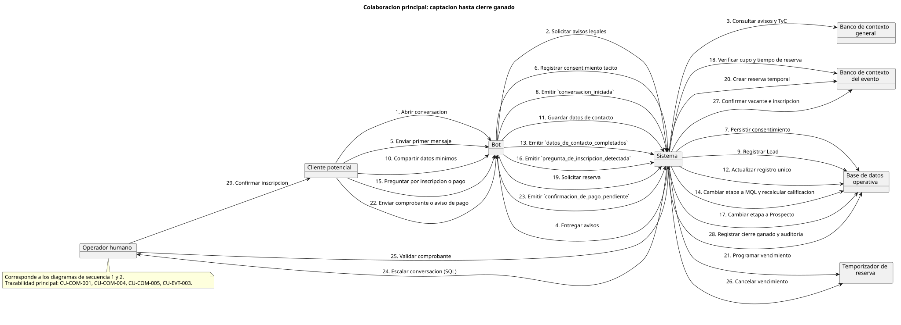
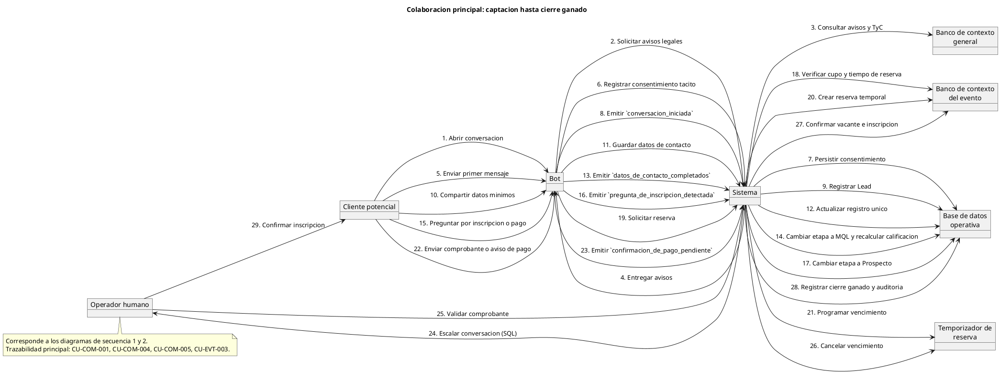
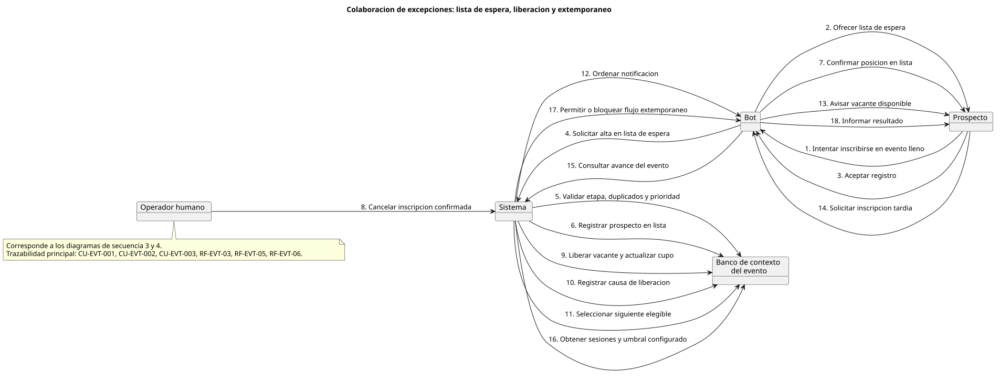
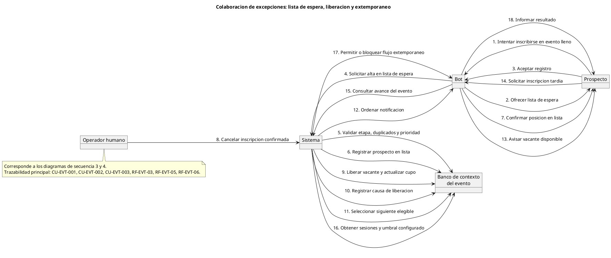

# Diagramas de Colaboración

Los diagramas de colaboración representan las relaciones estructurales entre los objetos que participan en los procesos del sistema, mostrando qué actores y componentes se comunican entre sí y mediante qué mensajes, sin enfocarse en el orden temporal. Complementan a los diagramas de secuencia al ofrecer una vista de la red de colaboraciones del sistema.

Se presentan dos diagramas que cubren el ciclo completo del proceso comercial y de gestión de cupo:

1. **Captación hasta cierre ganado** — muestra las colaboraciones desde la apertura de conversación hasta la confirmación de inscripción, incluyendo el registro del consentimiento tácito, las transiciones de etapa comercial, la reserva temporal de vacante y la validación de pago por el operador humano.
2. **Excepciones: lista de espera, liberación y extemporáneo** — modela las colaboraciones asociadas al registro en lista de espera, la liberación de vacante por cancelación y la notificación al siguiente elegible, así como la validación de inscripciones extemporáneas según el avance del evento.

Cada diagrama incluye una nota de trazabilidad con los casos de uso y requerimientos funcionales que cubre.

## 1. Colaboración principal: captación hasta cierre ganado

- Diagrama:

- Codigo:

## 2. Colaboración de excepciones: lista de espera, liberación y extemporáneo

- Diagrama:

- Codigo:

