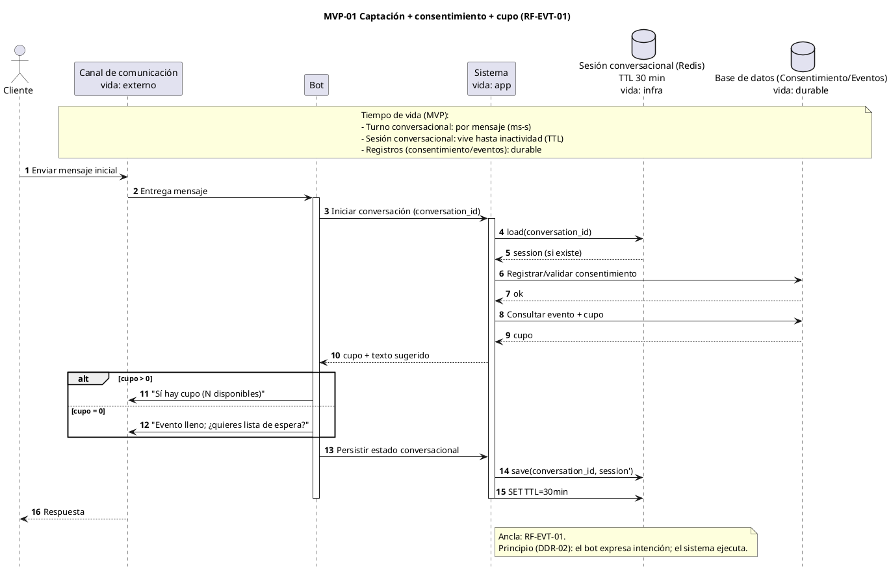
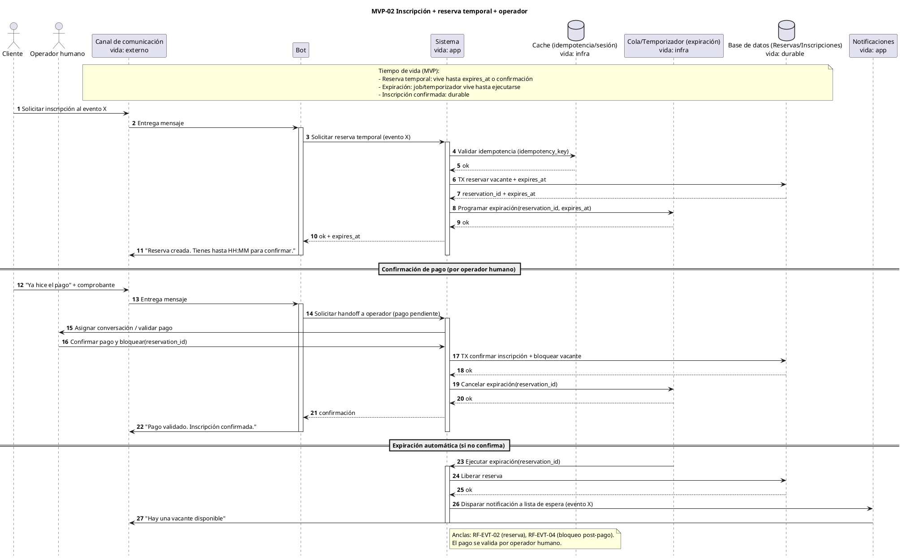
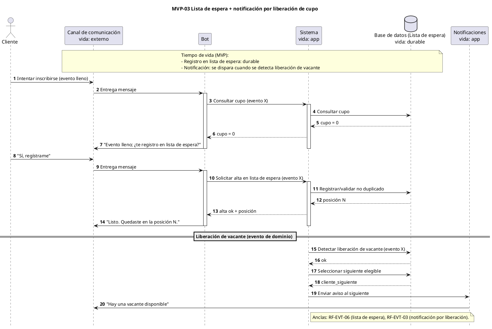

# Diagramas de Secuencia — MVP (EVT)

Este archivo contiene los **diagramas de secuencia del MVP** descrito en el guion de presentación (`docs/soporte/presentacion/presentacion-diseno-mvp.md`).

## Alcance del MVP

Incluye:

- Canal: Canal de comunicación.
- Captación inicial y registro de consentimiento.
- Verificar cupo y comunicarlo (**RF-EVT-01**).
- Solicitar inscripción con reserva temporal y expiración (flujo simplificado).
- Escalamiento a operador humano para validar pago (flujo simplificado).
- Si `cupo = 0`: informar “evento lleno” y ofrecer lista de espera (**RF-EVT-06**).
- Registro en lista de espera y notificación ante liberación de cupo (**RF-EVT-03**).

Nota (MVP): los participantes se nombran **de forma genérica** a propósito (Cliente/Canal de comunicación/Bot/Sistema/DB). Los nombres de módulos/microservicios pertenecen al diagrama completo.

Principio de diseño (DDR-02): **El bot expresa intención; el sistema ejecuta operaciones**.

---

## MVP-01. Captación, consentimiento y verificación de cupo (RF-EVT-01)

- Objetivo: iniciar conversación, registrar consentimiento y responder cupo del evento.

---

## MVP-02. Inscripción con reserva temporal y validación humana (RF-EVT-02, RF-EVT-04)

- Objetivo: reservar temporalmente una vacante, escalar validación de pago a operador y confirmar o expirar.

---

## MVP-03. Lista de espera y notificación por liberación de cupo (RF-EVT-06, RF-EVT-03)

- Objetivo: registrar al cliente en lista de espera y notificar al siguiente elegible cuando se libera una vacante.

---

## Artefactos relacionados del MVP (excepto Casos de Uso)

Este apartado apunta a los artefactos ya existentes que respaldan el MVP, **sin incluir** documentos de Casos de Uso.

- Presentación (guion): `docs/soporte/presentacion/presentacion-diseno-mvp.md`
- Presentación (.pptx): `docs/soporte/presentacion/presentacion-diseno-mvp.pptx`

- Decisiones:
  - DDR-01: `docs/diseño/decisiones/DDR-01-impacto-de-rf-com-02-en-los-casos-de-uso.md`
  - DDR-02: `docs/diseño/decisiones/DDR-02-decisiones-arquitectonicas-del-orquestador.md`

- RNF (drivers):
  - RNF-02 Rendimiento: `docs/analisis/requerimientos/no funcionales/RNF-02 Rendimiento del bot.md`
  - RNF-04 Continuidad: `docs/analisis/requerimientos/no funcionales/RNF-04 Continuidad de la conversación.md`

- RF ancla del MVP:
  - RF-EVT-01: `docs/analisis/requerimientos/funcionales/EVT/RF-EVT-01 Verificacion de disponibilidad de cupo.md`
  - RF-EVT-02: `docs/analisis/requerimientos/funcionales/EVT/RF-EVT-02 Reservacion de vacante durante proceso de venta.md`
  - RF-EVT-03: `docs/analisis/requerimientos/funcionales/EVT/RF-EVT-03 Notificacion de usuarios ante una liberacion de cupo.md`
  - RF-EVT-04: `docs/analisis/requerimientos/funcionales/EVT/RF-EVT-04 Bloqueo de vacantes despues de confirmacion de pago.md`
  - RF-EVT-06: `docs/analisis/requerimientos/funcionales/EVT/RF-EVT-06 Gestion de lista de espera.md`

- Arquitectura y blueprint de código:
  - `docs/diseño/arquitectura/estructura-de-codigo.md`
  - Estrategia v2.0: `utils/estrategia de implementacion chat.md`

- Diagramas de diseño (complementarios):
  - Colaboración: `docs/diseño/comportamiento/colaboracion/diagrama-colaboracion.md`
  - Secuencia (completo): `docs/diseño/comportamiento/secuencia/diagrama-secuencia.md`
