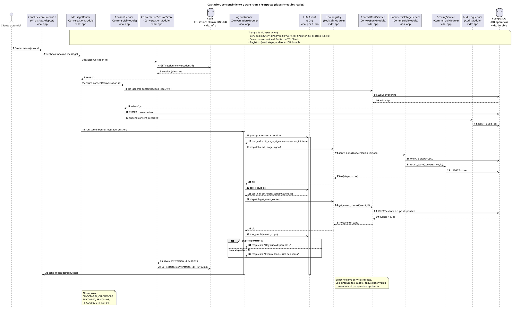
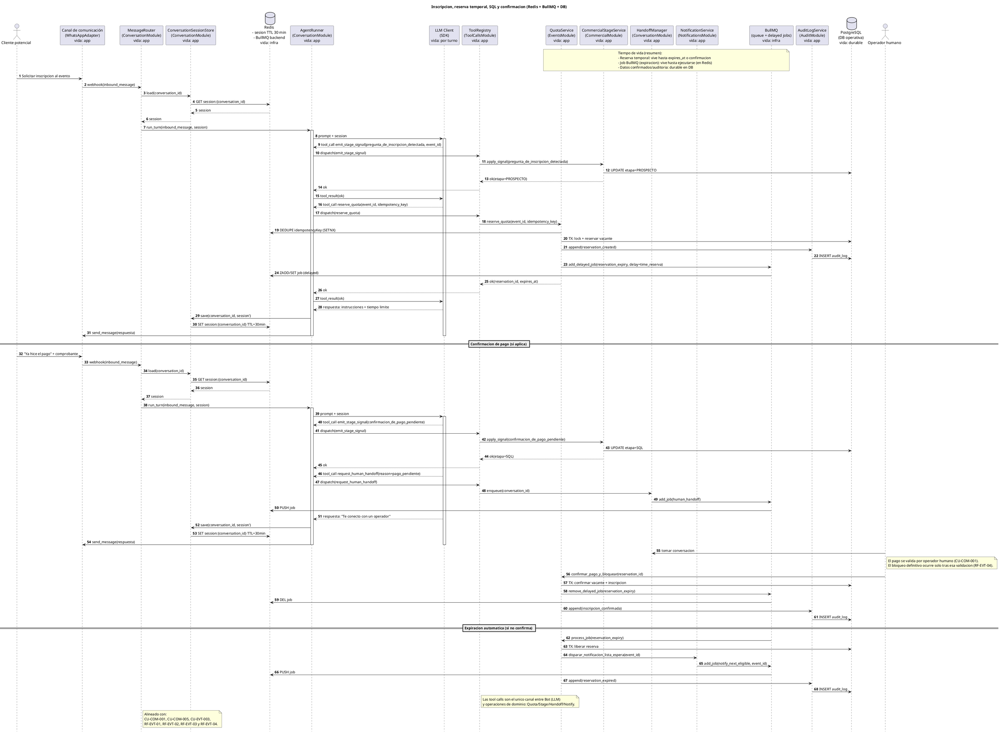
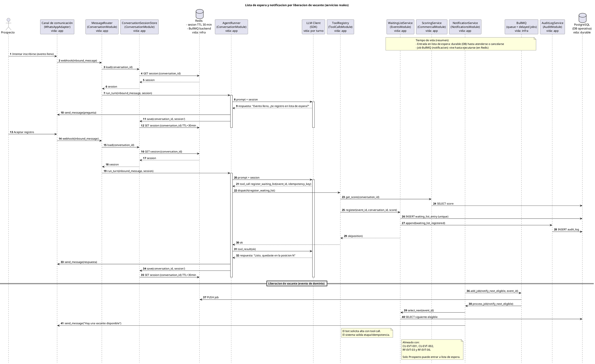
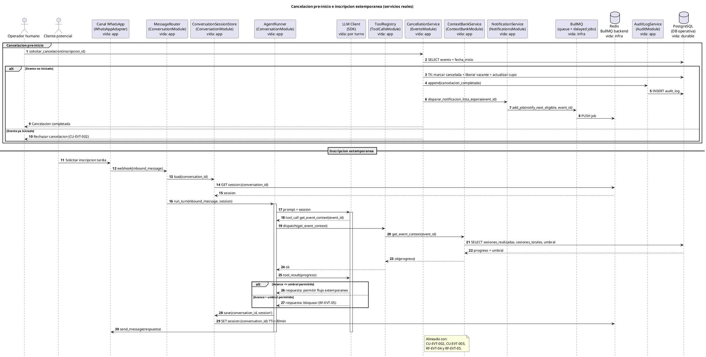

# Diagramas de Secuencia

Los diagramas de secuencia modelan las interacciones entre los actores del sistema a lo largo del tiempo, mostrando el orden en que ocurren los mensajes dentro de cada proceso. Se organizan en cuatro diagramas que cubren el ciclo completo del proceso comercial:

1. **Captación, consentimiento y transición a Prospecto** — cubre el inicio de la conversación, el registro del consentimiento tácito, la recopilación de datos de contacto y la transición de etapa desde Lead hasta Prospecto, incluyendo la verificación de cupo previa a la inscripción.
2. **Inscripción, reserva temporal, SQL y confirmación** — modela la reserva temporal de vacante, el control de vencimiento por temporizador, el escalamiento a operador humano en etapa SQL y los flujos de confirmación o rechazo de pago.
3. **Lista de espera y notificación por liberación de vacante** — describe el registro en lista de espera para eventos sin cupo disponible, el proceso de liberación de vacante y la notificación al siguiente Prospecto elegible.
4. **Cancelación pre-inicio e inscripción extemporánea** — cubre la cancelación de una inscripción confirmada antes del inicio del evento y la validación del avance del evento para permitir o bloquear inscripciones tardías.

En todos los diagramas se distingue entre `vacante` (lugar individual dentro del evento) y `cupo` (capacidad total del evento), de acuerdo con las definiciones establecidas en el glosario del sistema.

## 1. Captación, consentimiento y transición a Prospecto

- Diagrama:

- Codigo:

## 2. Inscripción, reserva temporal, SQL y confirmación

- Diagrama:

- Codigo:

## 3. Lista de espera y notificación por liberación de vacante

- Diagrama:

- Codigo:

## 4. Cancelación pre-inicio e inscripción extemporánea

- Diagrama:

- Codigo:

